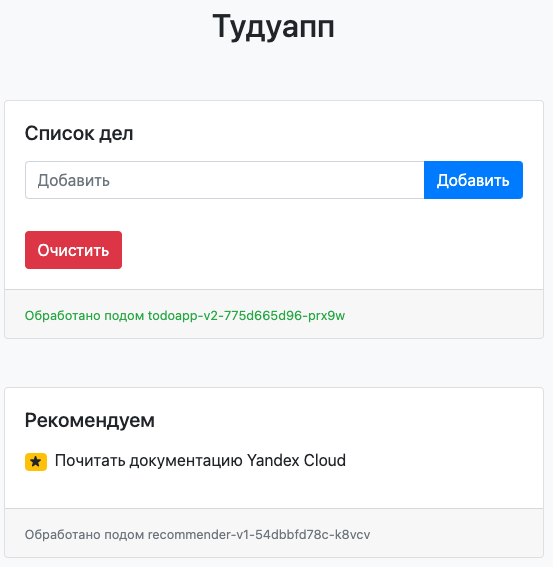

# Todoapp



Данный репозиторий содержит демонстрационное приложение для Kubernetes, состоящее из нескольких микросервисов.
Приложение позволяет продемонстрировать различный функционал Istio, но может быть использован и в других демо сценариях, без использования Istio.

Приложение состоит из следующих микросервисов:
- `todoapp` – основной микросервис для наполнения страницы.
- `recommend` – микросервис поставляющий рекомендации.
- `redis` – микросервис для хранения заполненной информации.

Сервис `todoapp` имеет две версии:
- Версия `v1` не делает обращений к сервису `recommend`.
- Версия `v2` делает обращения к сервису `recommend` и выводит результат.

Приложение выглядит следующим образом:


## Установка

Чтобы установить приложение можно следующей командой:
```
kubectl apply -f kube/todoapp.yaml
```
 
 Если в кластере развернут Istio, можно опубликовать приложение, создав Gateway и Virtual Service:
 ```
 kubectl apply -f kube/todoapp-gateway.yaml
 ```

 Приложение будет доступно по IP-адресу Istio Ingress-шлюза.

 ## Практическое руководство

 Подробное практическое руководство, использующее данный пример, доступно в документации Yandex Cloud.

> Ссылка на практическое руководство будет добавлена после публикации
